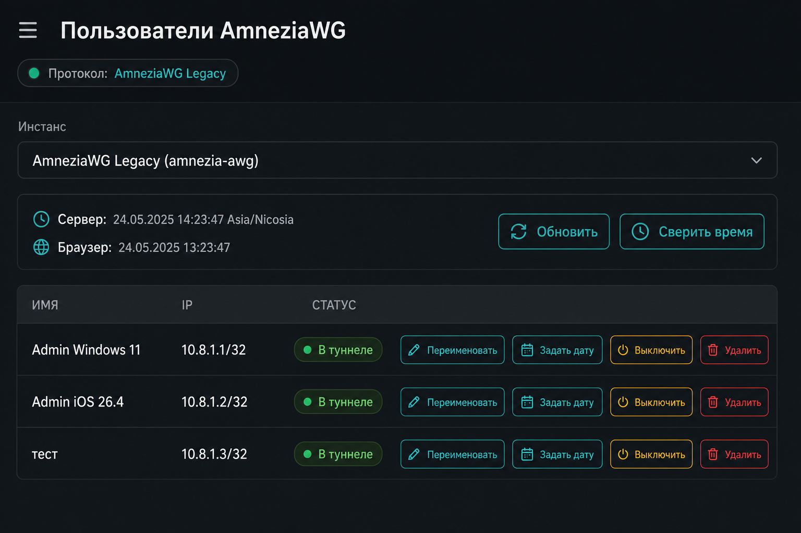
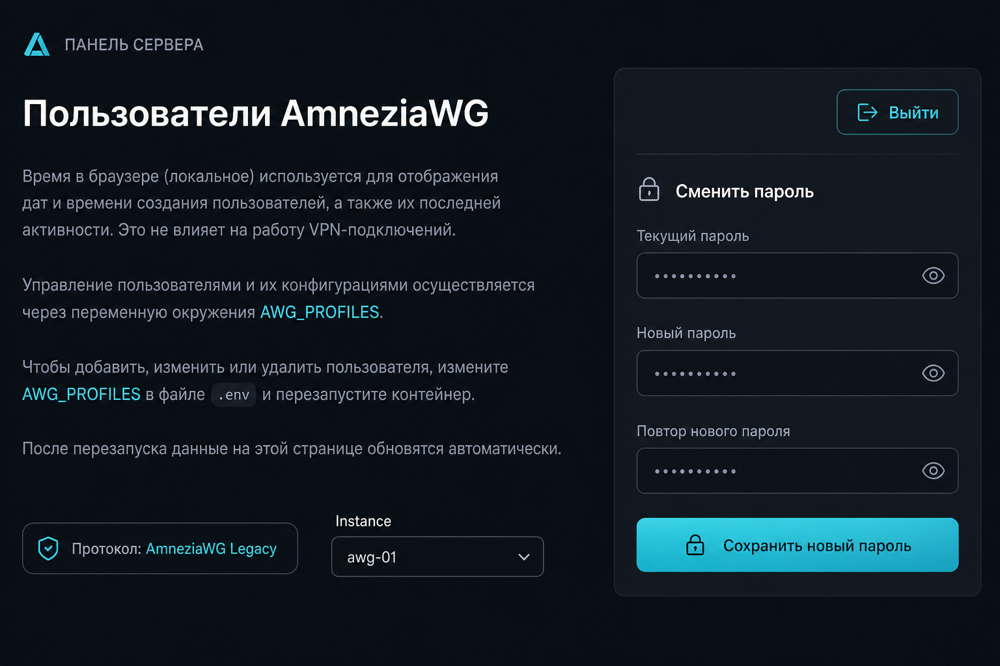

# amnezia_web

Веб‑панель **AmneziaWG** на своём VPS (**Docker**): таблица клиентов, статусы «в туннеле», AllowedIPs, несколько инстансов через **`AWG_PROFILES`**, часы сервера и браузера, смена пароля панели.

**Базовая открытая панель:** просмотр клиентов, **удаление** peer с сервера, раздел установки **Telegram MTProto‑прокси** (Docker), несколько инстансов через **`AWG_PROFILES`**, смена пароля. Вкл/выкл клиентов, даты, переименование, экспорт `.conf`, каскад, Cloudflare WARP и синхронизация времени хоста в этой версии **не поддерживаются**.

---

## Amnezia Web — зачем этот проект

**Безопасный доступ к интернету без сложной настройки панели**

**Amnezia Web** (`amnezia_web`) — это **веб‑панель для администрирования уже развёрнутого сервера AmneziaWG**: клиенты, статусы, несколько инстансов WireGuard на одном VPS (**`AWG_PROFILES`**), пароль доступа и дополнительные блоки в браузере — вместо ручной возни только через SSH и конфиги.

Проект ориентирован на тех, кому важны:

* приватность и контроль над своим узлом;
* стабильная работа привычного VPN‑стека Amnezia;
* понятный интерфейс без лишней боли в повседневном администрировании.

Установка панели и лендинга — **скриптом одной командой** в Docker; сам VPN‑контейнер AmneziaWG вы обычно поднимаете своим способом (как уже делаете с экосистемой Amnezia).

---

### Что умеет Amnezia Web

* **Управление через браузер** — таблица клиентов AmneziaWG, время сервера и браузера, удаление peer, установка MTProto‑прокси.
* **Быстрое развёртывание панели** — образ админки и опционально страницы для пользователей через **`scripts/install.sh`**.
* **Приватность** — всё крутится **на вашем VPS**; доступ к панели ограничиваете паролем (и при желании сетью/TLS).
* **Удобство** — одно место для обзора клиентов и (в FREE) установки **MTProto‑прокси** из интерфейса.
* **Несколько инстансов AWG на одном хосте** — переключатель профилей через **`AWG_PROFILES`**.
* **Современный стек** — Docker, Node.js, веб‑интерфейс.

---

### Для кого этот проект

* администраторам своего VPS с AmneziaWG;
* тем, кому нужна простая панель поверх уже знакомого стека Amnezia;
* небольшим группам пользователей одного сервера.

---

### Почему проект развивается

Независимое **open‑source** решение для тех, кому нужен удобный инструмент администрирования без перегруженных коммерческих панелей. Идея — упростить сопровождение своего узла и при этом не навязывать чужую инфраструктуру.

---

### Поддержка проекта

Ссылки на GitHub, Boosty, Ozon СБП и Telegram — **в конце этого README**. Также можно поставить ⭐ репозиторию и рассказать тем, кому будет полезно.

Спасибо всем, кто поддерживает развитие проекта.

---

## Скриншоты

Интерфейс ориентирован на просмотр клиентов, удаление peer и установку MTProto‑прокси; расширенные действия с клиентами в UI недоступны.

<p align="center">

<br/><br/>

<br/><br/>


---


## Установка

```bash
curl -fsSL https://raw.githubusercontent.com/andrey271192/amnezia_web/main/scripts/install.sh | sudo bash
```

Смена порта (пример):

```bash
curl -fsSL https://raw.githubusercontent.com/andrey271192/amnezia_web/main/scripts/install.sh \
  | sudo -E env HOST_PORT=8884 LANDING_PORT=8081 bash
```

---

## Обновление

Обычно достаточно:

```bash
curl -fsSL https://raw.githubusercontent.com/andrey271192/amnezia_web/main/scripts/install.sh | sudo bash
```

После сообщения **`→ Клонирование релиза …`** несколько минут **может ничего не печататься**: идёт `curl … | tar` с GitHub. Для **полосы прогресса**: `sudo INSTALL_SCRIPT_VERBOSE=1 bash` (или передайте переменную в окружение до `|`). Если обрывает по времени или «тишина» часами задайте таймауты: **`CURL_CONNECT_TIMEOUT`** (по умолчанию 30 с к подключению), **`CURL_MAX_TIME`** (по умолчанию до 900 с на загрузку), **`CURL_RETRY`**. Полный URL tar.gz можно подменить: **`GITHUB_REPO_URL_OVERRIDE`** (должен указывать на архив того же вида **`${REPO}-${BRANCH}.tar.gz`**, после распаковки каталог будет **`ИмяРепозитория-${BRANCH}`**).

Принудительная пересборка образа: **`NO_CACHE=1`**.

---

## Удаление

```bash
curl -fsSL https://raw.githubusercontent.com/andrey271192/amnezia_web/main/scripts/uninstall.sh | sudo bash
```

---

## Частые проблемы


### Установка «зависла» на сообщении **`→ Клонирование релиза …`** и долго без вывода

Это этап **скачивания и распаковки** архива с GitHub. Запустите установщик с **`INSTALL_SCRIPT_VERBOSE=1`** (полоска загрузки `curl`). Задайте **`CURL_MAX_TIME`** если нужно усечь ожидание. При блокировках GitHub с хоста — зеркальный полный URL в **`GITHUB_REPO_URL_OVERRIDE`** (см. раздел «Обновление»).

### `SKIP_DOWNLOAD=1 bash scripts/install.sh` завершается сразу без вывода («нифига» не происходит)

В старых версиях под **`set -o pipefail`** подсчёт контейнеров через **`grep`** падал, если **нет ни одного запущенного имени `amnezia-awg…`**; отдельно тот же эффект давал пайплайн **`docker port … | head | awk`** при **остановленном** `amnezia-admin`: `docker inspect` ещё «видит» контейнер, а **`docker port` возвращает ошибку**. Скрипт обрывался до **«Сборка образа»**. Обновите **`scripts/install.sh`** до актуального из `main` или временно выполните **`docker rm -f amnezia-admin`** перед установкой.

### Лендинг: порт 80 занят

Если на хосте уже что-то слушает **TCP 80**, установщик сообщит об этом и, при дефолтном **`LANDING_PORT=80`**, сам попробует другой свободный порт (обычно начиная с **8081**). Либо явно: **`LANDING_PORT=8083`**, либо **`SKIP_LANDING=1`**.

### Раздел MTProto или вся панель: ошибка «Not found», API не отвечает

Чаще всего браузер бьётся не в **Node**‑процесс панели, а в **прокси** (nginx и т.п.) с неполным маппингом: **`/api/mtproto/*`**, **`/api/clients`** и остальное должны уходить на тот же upstream, что и **`/`** панели. Должен проксироваться **любой** путь под **`/api/`**, а не только отдельные location. На самой VPS **`curl -fsS http://127.0.0.1:ПОРТ_ПАНЕЛИ/health`** должен вернуть JSON с **`version`**. Если с localhost работает, а через домен — **404**, смотрите конфигурацию обратного прокси и TLS.

### AmneziaWG Legacy: удаление клиента не срабатывает (`wg0.conf is world accessible` / `No such device`)

Панель синхронизирует живой интерфейс через **`wg-quick strip` + `syncconf`**. У Legacy конфиг часто **`/opt/amnezia/awg/wg0.conf`**, интерфейс — **`wg0`**, не **`awg0`**. В актуальном коде интерфейс выводится из **имени файла** (**`wg0.conf` → `wg0`**). Если путь другой — задайте в профиле **`AWG_IFACE`** / в **`AWG_PROFILES`** поле **`iface`**. Предупреждение про world-accessible: перед применением конфига файл на стороне контейнера выставляется в **`chmod 600`**.

---

## Лицензия

MIT — см. [LICENSE](LICENSE).

---

## Поддержка проекта

---

- ⭐ **GitHub:** [andrey271192/amnezia_web](https://github.com/andrey271192/amnezia_web)
- 💖 **Boosty:** [boosty.to/andrey27/donate](https://boosty.to/andrey27/donate)
- 💳 **Ozon Bank (СБП):** [ссылка](https://finance.ozon.ru/apps/sbp/ozonbankpay/019dc200-2a5d-7931-a619-782d285f6798)
- ✉️ **Telegram:** [@lot_andrey](https://t.me/lot_andrey)
